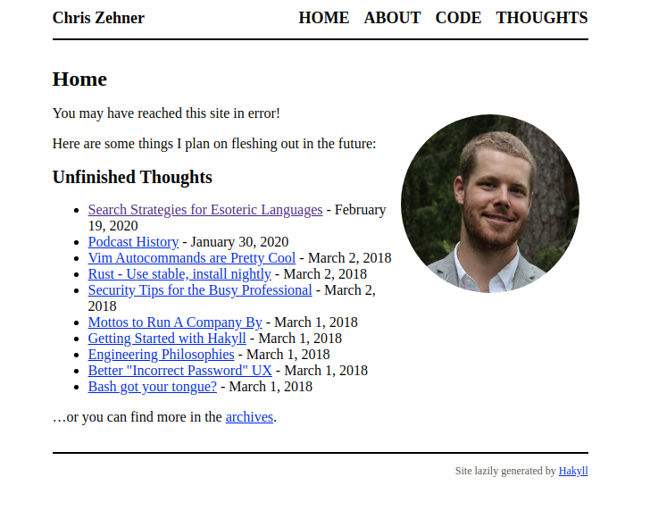
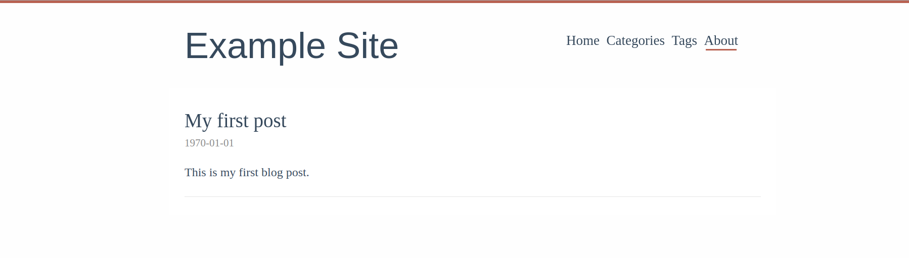
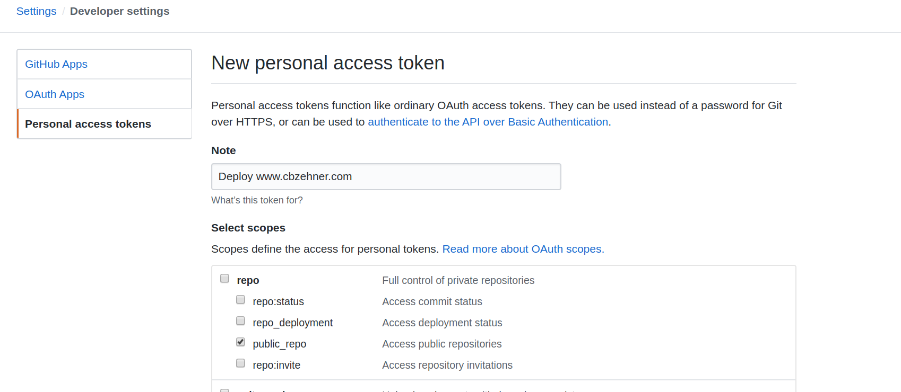

+++
title = "Switching to Zola from Hakyll"
date = 2019-04-07
draft = false

[taxonomies]
# tags = ["rust", "web"]
categories = ["programming"]
+++

# Time for a Change

For the past few years, I've served my static site with [GitHub pages](https://pages.github.com/) and generated the source with [Hakyll](https://jaspervdj.be/hakyll). Since it's time for a redesign, why not change the static generator as well?

This post will walk through setting up a new Zola site with a pre-configured theme and deploying it via GitHub Pages, the same way my Hakyll site was deployed.

The old design is a bit long-in-the-tooth.



The rest of this article will walk through the steps I used to create this site.

# Getting Started with Zola

## The Bare Necessities

First, [install Zola](https://www.getzola.org/documentation/getting-started/installation/) on your local machine. I'm running [elementary OS](https://elementary.io/) so I used the snap package `snap install --edge zola`. Now create a fresh Zola installation with `zola init <website-name>` and answer the basic questions, if you're not sure just hit `Enter` to take the default configuration option, it's easy to change later! If you're porting over an existing site, don't worry, we'll cover that once we get the basic structure set up.

Before we go any further, let's ensure our project is set up correctly. Switch to the project directory with `cd <website-name>` and run `zola serve`. Navigate to the provided URL, I got `http://127.0.0.1:1111/` and you should see a `Welcome to Zola!` message asking you to set up an `index.html` file or install a theme.

## Choosing a Theme

We're going to install a theme, but you can [follow the Zola docs](https://www.getzola.org/documentation/getting-started/overview/) to set up a custom site as well. There a couple [different themes to choose from](https://www.getzola.org/themes/) and you [can find many more on GitHub](https://github.com/search?q=zola+filename%3Atheme.toml&type=Code). For my personal website, I will be writing short tutorials and medium length blog posts. I choose [Even](https://github.com/getzola/even), a simple theme that doesn't distract from the content based on a Hugo theme of the same name.

Now follow the [installation instructions from Even](https://github.com/getzola/even#installation). You should create a new file `content/_index.md` that matches the installation instructions and your `config.toml` should now look like:

```TOML
# The URL the site will be built for
base_url = "https://example.com"

# --snip--

theme = "even"

taxonomies = [
  # You can enable/disable RSS
  {name = "categories", rss = true},
  {name = "tags", rss = true},
]

[extra]
# Put all your custom variables here

# The site title show in the header
even_title = "Example Site"

# This is the default menu
even_menu = [
    {url = "$BASE_URL", name = "Home"},
    {url = "$BASE_URL/categories", name = "Categories"},
    {url = "$BASE_URL/tags", name = "Tags"},
    {url = "$BASE_URL/about", name = "About"},
]
```

Now we've got our theme up and running! Try it out with `zola serve`


## Make a Post

Now all that's left is to share our work with the world! Let's update `content/first_post.md` to contain the following:

```Markdown
+++
title = "My first post"
date = 1970-01-01
+++

This is my first post.
```

Try `zola serve` one more time and you should see



## Copy an Existing Site

If you have an existing static site that you want to preserve, one easy way of doing so is to keep it under version control. I checked out my old site from my git repository to a directory called `cbzehner_hakyll`.

```bash
❯ exa -T -L 2 -a
.
├── cbzehner
│  ├── config.toml
│  ├── content
│  ├── public
│  ├── sass
│  ├── static
│  ├── templates
│  └── themes
├── cbzehner_hakyll
│  ├── .git
│  ├── .gitignore
│  ├── cbzehner-github-io.cabal
│  ├── docs
│  ├── README.md
│  ├── site.hs
│  ├── src
│  ├── stack.yaml
│  └── stack.yaml.lock
```

Copy the `.git/` directory from the old repository to the current project with `copy -r ../cbzehner_hakyll .`. This will preserve the history of the previous static site inside this repository. Update the `.gitignore` file to exclude the `public/` directory where Zola places the build output:

```bash
# Exclude the build directory from version control
public/
```

Now we want to make sure we properly track our theme, which we added as a git submodule. Running `git add .` will generate a warning letting us know to run `git submodule add git@github.com:getzola/even.git themes/even ` which tracks this module as a seperate repository.

Now we need to move the content over from our previous static site generator to Zola. This may take a while, but I'll wait, I'm not in any rush...

All done? Great! Finally, set up all our files to be tracked with `git add .` and then commit this using `git commit -m 'refactor: migrate to Zola'`!

We're nearly done. Wouldn't it be nice if changes to our GitHub repository were automatically deployed to our website? That's next!

## Deploy to GitHub

The last step now that we have our site up-and-running is to deploy it to [GitHub Pages](https://guides.github.com/features/pages/) when we push a change to the `master` branch. I already have [a custom domain](https://help.github.com/en/github/working-with-github-pages/about-custom-domains-and-github-pages) set up. So all I need to do is copy my previous `CNAME` file into `static/CNAME` so that Zola picks it up at build-time.

We will deploy our changes with GitHub Actions, the [Zola Deploy to Pages](https://github.com/marketplace/actions/zola-deploy-to-pages) action will check out the newly changed master branch and build Zola on a `gh-pages` branch. To set this up we'll need to add GitHub Actions to our repository and set a private access token for the action to use.

To run this GitHub Action we first need to create a new directory with `mkdir -p .github/workflows`. The `workflows/` directory stores all [GitHub Workflows](https://help.github.com/en/actions/configuring-and-managing-workflows/configuring-a-workflow). Inside this directory create a new file `deploy.yml` which configures the action.

```yaml
name: Deploy static site
on: push
jobs:
  build:
    name: Build site with Zola and deploy
    runs-on: ubuntu-latest
    steps:
    - uses: actions/checkout@master
    - name: Zola Deploy Action by @shalzz
      uses: shalzz/zola-deploy-action@master
      env:
        PAGES_BRANCH: gh-pages
        TOKEN: ${{ secrets.TOKEN }}
```

We're not quite ready to run it yet, we need to [set up a personal access token](https://github.com/marketplace/actions/zola-deploy-to-pages#secrets) for "Zola Deploy to Pages" to use.

Since this repository is public I can create an [access token](https://github.com/settings/tokens/new) with the `public_repo` scope. If the repository is private, you may need the full `repo` scope, which differs from this screenshot.



Now take the generated token and add it to your repo under `/settings/secrets/new` as `TOKEN` so it matches the configuration in the `deploy.yml` file.


With all of this done we can push these changes up to GitHub. After this lands, the next changes we make will automatically deploy our code to the `gh-pages` branch. Once that happens, we need to go into our repository settings and change the "Source" for "GitHub Pages" to be `gh-pages branch`.

## Finish Line

🎉 That's everything! Your site is built with Zola and deployed via GitHub Actions & GitHub Pages. Go check it out!
