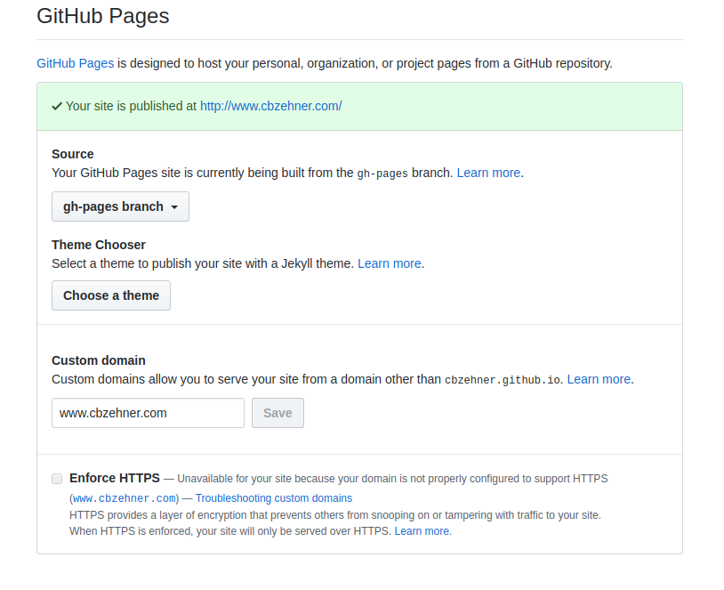
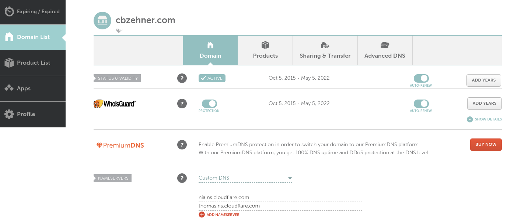
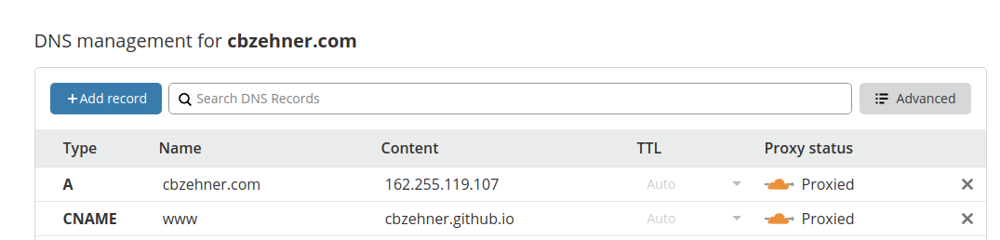
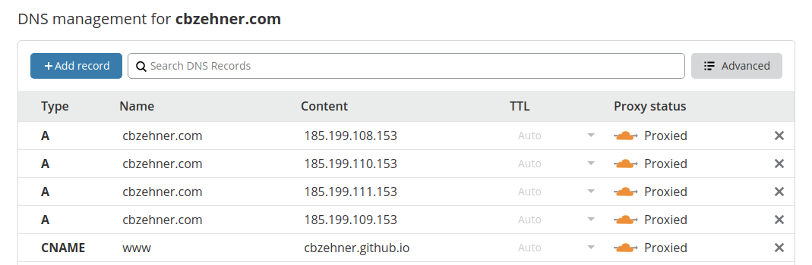

+++
title = "Securing GitHub Page with a Custom Domain"
date = 2020-04-08
draft = true
+++

Now that our domain is up and running, just one issue. It's using `http` rather than `https`. For a vanity website this isn't a huge deal, but let's see if we can fix it and we'll learn something along the way.

## GitHub Page Settings

When we go to our repository settings we can see that the "Enforce HTTPS" option is disabled.



If we follow the GitHub documentation we eventually end up at https://help.github.com/en/github/working-with-github-pages/managing-a-custom-domain-for-your-github-pages-site which suggests we use `dig` to investigate how our DNS records are set up.

## Digging DNS Records

Here's a quick primer on `dig`
```bash
❯ tldr dig

  dig

  DNS Lookup utility.

  - Lookup the IP(s) associated with a hostname (A records):
    dig +short example.com

  - Lookup the mail server(s) associated with a given domain name (MX record):
    dig +short example.com MX

  - Get all types of records for a given domain name:
    dig example.com ANY

  - Specify an alternate DNS server to query:
    dig @8.8.8.8 example.com

  - Perform a reverse DNS lookup on an IP address (PTR record):
    dig -x 8.8.8.8

  - Find authoritative name servers for the zone and display SOA records:
    dig +nssearch example.com

  - Perform iterative queries and display the entire trace path to resolve a domain name:
    dig +trace example.com
```

So now we check how our custom domain is currently set up
```bash
❯ dig www.cbzehner.com +nostats +nocomments +nocmd

; <<>> DiG 9.11.3-1ubuntu1.11-Ubuntu <<>> www.cbzehner.com +nostats +nocomments +nocmd
;; global options: +cmd
;www.cbzehner.com.              IN      A
www.cbzehner.com.       300     IN      A       104.18.46.169
www.cbzehner.com.       300     IN      A       104.18.47.169
```

This doesn't match the setup suggested in https://medium.com/@goelanirudh/add-https-to-your-namecheap-domain-hosted-on-github-pages-d66fd96308b5 so let's figure this out...

## Case of the Missing Records

If we go check out our domain in Namecheap...oops! It's completely missing.



We've already moved management of our domain to Cloudflare so we could play around with Cloudflare Workers.

Loading up Cloudflare we can see the current records for our domain. This matches our `dig` command from early. I'm starting to feel like we're on the right track!



## Mystery IPs

But something still doesn't look right, notice how we have so many fewer A Records than in Anirudh's article? Luckily he provides a screenshot of his DNS records after he's done setting it up. Where did he get those 4 IPs from?

I have a hunch! Pulling out our new best friend `dig` we can run the same command we can against our domain against his custom domain and his GitHub Page domain. Let's see what that looks like:

```bash
❯ dig anirudhgoel.me +nostats +nocomments +nocmd

; <<>> DiG 9.11.3-1ubuntu1.11-Ubuntu <<>> anirudhgoel.me +nostats +nocomments +nocmd
;; global options: +cmd
;anirudhgoel.me.                        IN      A
anirudhgoel.me.         1799    IN      A       185.199.109.153
anirudhgoel.me.         1799    IN      A       185.199.110.153
anirudhgoel.me.         1799    IN      A       185.199.111.153
anirudhgoel.me.         1799    IN      A       185.199.108.153

❯ dig anirudhgoel.github.io +nostats +nocomments +nocmd

; <<>> DiG 9.11.3-1ubuntu1.11-Ubuntu <<>> anirudhgoel.github.io +nostats +nocomments +nocmd
;; global options: +cmd
;anirudhgoel.github.io.         IN      A
anirudhgoel.github.io.  2826    IN      A       185.199.110.153
anirudhgoel.github.io.  2826    IN      A       185.199.108.153
anirudhgoel.github.io.  2826    IN      A       185.199.111.153
anirudhgoel.github.io.  2826    IN      A       185.199.109.153
```

It appears the IPs Anirudh used to set up his A Records came from the `*.github.io` domain. Let's try doing the same thing with our domain.

## Setting the Record Straight

First let's retrieve the IPs GitHub Pages uses to host our `*.github.io` domain.

```bash
❯ dig cbzehner.github.io +nostats +nocomments +nocmd

; <<>> DiG 9.11.3-1ubuntu1.11-Ubuntu <<>> cbzehner.github.io +nostats +nocomments +nocmd
;; global options: +cmd
;cbzehner.github.io.            IN      A
cbzehner.github.io.     2731    IN      A       185.199.109.153
cbzehner.github.io.     2731    IN      A       185.199.111.153
cbzehner.github.io.     2731    IN      A       185.199.110.153
cbzehner.github.io.     2731    IN      A       185.199.108.153
```

Now let's take these IPs and set them as our new A Records for our custom domain as well. If you use a different DNS provider this will work exactly the same, don't worry!



Great! Now go grab a coffee while we wait for our DNS changes to propogate. This could be a while...

You can confirm the propogation is complete when `dig`'ing your custom domain shows the new entries.

## Resolving Mixed Content Issues

Unfortunately we're going to run into a few more issues before we're done here. The site is currently set to serve content from `http://www.cbzehner.com` which means even if we access the site via `https` we're still fetching content from an insecure `http://...` URL. Test out your site by visiting it from a secure URL, like `https://www.cbzehner.com` and see what loads.

TODO: Screenshot of Site

TODO: Screenshot of Warnings

I fixed this pretty handily by updating the `base_url` value of my Zola `config.toml` to use `https` instead of `http`. Now when visiting the `http` version of the site, the browser client is directed to use `https` to request extra resources like CSS and Javascript.

But I'm still waiting on DNS records to update, maybe it's time to stop drinking coffee?

## Propogation Party

One more issue with our DNS propogation. It's been several hours and the old records are still showing up. It turns out that Cloudflare's `1.1.1.1` DNS service is caching these records. We'll need to [purge the cache](https://cloudflare-dns.com/purge-cache/).

Our DNS records have finally propogated
